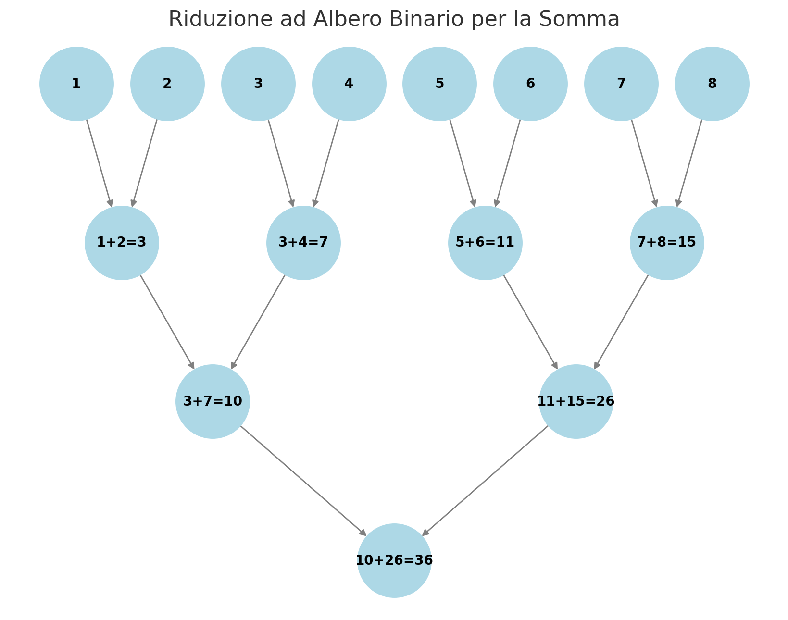

# Somma di N Numeri (2 Strategia di Somma)

## Descrizione
Questo programma utilizza **OpenMP** per calcolare la somma di `N` numeri, sfruttando la **seconda strategia di somma**: l'uso della direttiva **`reduction(+:sum)`**. Questa strategia garantisce una gestione più efficiente della somma totale, evitando problemi di race condition senza bisogno di variabili condivise per accumulare le somme parziali.

## Funzionamento di `reduction(+:sum)`
La direttiva `reduction(+:sum)` permette di eseguire la somma in parallelo senza utilizzare variabili condivise. Ogni thread calcola la sua somma parziale e OpenMP gestisce automaticamente l'aggregazione dei risultati.

### **Riduzione ad albero binario**
La riduzione in OpenMP viene eseguita con una struttura simile a un **albero binario**, dove i risultati parziali vengono combinati in più fasi:

1. Supponiamo di voler sommare il vettore `{1, 2, 3, 4, 5, 6, 7, 8, 9, 10, 11, 12, 13, 14, 15, 16}` utilizzando **8 thread**.
2. Ogni thread calcola la sua somma locale:
   - Thread 0 somma `{1, 2}` → **3**
   - Thread 1 somma `{3, 4}` → **7**
   - Thread 2 somma `{5, 6}` → **11**
   - Thread 3 somma `{7, 8}` → **15**
   - Thread 4 somma `{9, 10}` → **19**
   - Thread 5 somma `{11, 12}` → **23**
   - Thread 6 somma `{13, 14}` → **27**
   - Thread 7 somma `{15, 16}` → **31**

3. Nella seconda fase della riduzione, i risultati vengono combinati in coppie:
   - **3 + 7 = 10**
   - **11 + 15 = 26**
   - **19 + 23 = 42**
   - **27 + 31 = 58**

4. Nella terza fase, i risultati vengono ulteriormente combinati:
   - **10 + 26 = 36**
   - **42 + 58 = 100**

5. Nell'ultima fase, i risultati rimanenti vengono sommati:
   - **36 + 100 = 136**

L'operazione avviene in **log₂(t)** passi, riducendo il numero di somme necessarie e migliorando l'efficienza.

Di seguito è riportata una rappresentazione grafica del processo:



## Gestione del caso `N` non divisibile per `t`
Se il numero di elementi `N` non è perfettamente divisibile per il numero di thread `t`, alcuni thread devono elaborare un elemento in più. Questo viene gestito calcolando:

- `nloc = N / t` → numero base di elementi per thread
- `r = N % t` → numero di elementi rimanenti da distribuire

I primi `r` thread ricevono **un elemento in più** per garantire che tutti gli elementi vengano elaborati correttamente.

### **Esempio**
Se abbiamo `N = 7` e `t = 3`, la distribuzione sarà:
- Thread 0 → 3 elementi (indice: 0,1,2)
- Thread 1 → 2 elementi (indice: 3,4)
- Thread 2 → 2 elementi (indice: 5,6)

La variabile `step` aiuta a regolare l'offset, permettendo ai thread con ID maggiore di `r` di saltare gli elementi già assegnati ai primi `r` thread.

## Funzionamento del programma
1. L'utente sceglie il numero di core (`np`).
2. L'utente inserisce `N`, il numero di valori da sommare.
3. Viene allocato dinamicamente il vettore `a` e vengono letti gli `N` numeri.
4. I thread eseguono la somma in parallelo:
   - Il numero di elementi per thread è gestito considerando il resto `r`.
   - Viene utilizzata la direttiva `reduction(+:sum)`, che somma automaticamente i risultati parziali.
   - Ogni thread somma i propri elementi locali.
5. Il risultato finale viene stampato a schermo.

## Esempio di Input/Output
**Esempio di esecuzione:**
```
Con quanti core vuoi eseguire il calcolo?
3
Inserire N:
7
Inserire gli elementi nel vettore:
Inserire l'elemento 0-esimo: 1
Inserire l'elemento 1-esimo: 2
Inserire l'elemento 2-esimo: 3
Inserire l'elemento 3-esimo: 4
Inserire l'elemento 4-esimo: 5
Inserire l'elemento 5-esimo: 6
Inserire l'elemento 6-esimo: 7
La somma degli elementi del vettore è 28
```

## Struttura del Codice
- Allocazione dinamica del vettore `a`.
- Lettura dei dati da input.
- Utilizzo della direttiva `#pragma omp parallel` con `reduction(+:sum)`.
- Calcolo della somma in parallelo con riduzione ad albero binario.
- Stampa del risultato.


