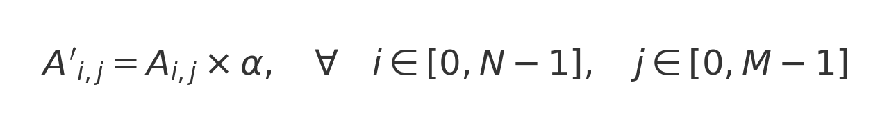

# Prodotto di una Matrice per uno Scalare (Divisione per Colonne)

## Descrizione
Questo programma utilizza **OpenMP** per eseguire il **prodotto di una matrice per uno scalare** sfruttando la **seconda strategia di parallelizzazione**, ovvero la **divisione per colonne**. Ogni thread elabora una o più colonne della matrice, moltiplicando ciascun elemento per un valore scalare `alpha`.

## Metodo di Calcolo
Il prodotto di una matrice `A` di dimensione `N × M` per uno scalare `α` si calcola come:



Dove `A'` è la matrice risultante.

## Differenza rispetto alla Divisione per Righe
- **Divisione per righe**:
  - Ogni thread lavora su righe intere della matrice.
  - Più efficiente in termini di accesso alla memoria (migliore località spaziale).
- **Divisione per colonne (usata in questo codice)**:
  - Ogni thread lavora su colonne intere della matrice.
  - Può essere meno efficiente su alcune architetture di memoria cache, ma utile per carichi di lavoro specifici.

## Parallelizzazione con OpenMP
La parallelizzazione avviene sulla variabile `j`, ovvero la **colonna** della matrice. Questo garantisce che ogni thread elabori un sottoinsieme di colonne:

```c
#pragma omp parallel for shared(N,M,matrice,alpha) private(i,j) num_threads(np)
{
    for(j=0;j<M;j++) {
        for(i=0;i<N;i++) {
            matrice[i][j] *= alpha;
        }
    }
}
```

### **Spiegazione del codice di parallelizzazione**
- `#pragma omp parallel for`: divide il ciclo più esterno (`for(j=0;j<M;j++)`) tra i thread disponibili.
- `shared(N,M,matrice,alpha)`: le variabili `N`, `M`, `matrice` e `alpha` sono **condivise** tra i thread.
- `private(i,j)`: ogni thread ha la propria copia delle variabili `i` e `j`, evitando interferenze.
- `num_threads(np)`: imposta il numero di thread definiti dall'utente.

#### **Come avviene la divisione per colonne**
- Il ciclo più esterno scorre sulle **colonne** (`j`), ed è su questo che avviene la **parallelizzazione**.
- Ogni thread lavora su **una o più colonne intere**, garantendo che non ci siano conflitti tra i thread.
- Il ciclo più interno (`for(i=0;i<N;i++)`) scorre sulle **righe** (`i`), elaborando ciascun elemento della colonna corrente.

### **Vantaggi della divisione per colonne**
- Utile per alcune architetture che favoriscono il caricamento **colonna per colonna** in memoria.
- Può ridurre il **contention sulla cache**, specialmente in sistemi con memoria distribuita.

## Funzionamento del Programma
1. L'utente sceglie il numero di core (`np`).
2. L'utente inserisce il numero di righe `N` e colonne `M` della matrice.
3. L'utente fornisce il valore dello scalare `alpha`.
4. Viene allocata la matrice e letti i valori da input.
5. Il prodotto tra la matrice e `alpha` viene calcolato in parallelo dividendo le **colonne** tra i thread.
6. Il risultato viene stampato e la memoria allocata viene liberata.

## Esempio di Input/Output
**Esempio di esecuzione:**
```
Con quanti core vuoi eseguire il calcolo? 2

Inserisci le righe della matrice(NxM): 2
Inserisci le colonne della matrice(NxM): 3

Inserisci lo scalare alpha: 3

Inserisci gli elementi della matrice (2x3)
Inserisci l'elemento[0][0]-->1
Inserisci l'elemento[0][1]-->2
Inserisci l'elemento[0][2]-->3
Inserisci l'elemento[1][0]-->4
Inserisci l'elemento[1][1]-->5
Inserisci l'elemento[1][2]-->6

Matrice originale:
1 2 3 
4 5 6 

Matrice dopo il prodotto con alpha: 
3 6 9 
12 15 18 
```

## Struttura del Codice
- **Allocazione dinamica della matrice**.
- **Lettura dei dati** da input.
- **Stampa della matrice originale**.
- **Calcolo parallelo del prodotto** della matrice per `alpha` dividendo per colonne.
- **Stampa del risultato**.
- **Deallocazione della memoria**.


