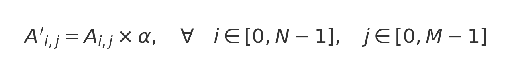

# Prodotto di una Matrice per uno Scalare (Divisione in Blocchi nqxnp)

## Descrizione
Questo programma utilizza **OpenMP** per eseguire il **prodotto di una matrice per uno scalare** sfruttando la **terza strategia di parallelizzazione**, ovvero la **divisione della matrice in blocchi** (`nq × np`). Ogni thread elabora un blocco della matrice, suddividendo il lavoro in modo più bilanciato rispetto alle strategie basate su righe o colonne.

## Metodo di Calcolo
Il prodotto di una matrice `A` di dimensione `N × M` per uno scalare `α` si calcola come:



Dove `A'` è la matrice risultante.

## Strategia della Divisione in Blocchi
- La matrice viene suddivisa in **nq** blocchi lungo le righe e **np** blocchi lungo le colonne.
- Ogni blocco ha dimensione **(N/nq) × (M/np)** (arrotondato in caso di dimensioni non divisibili esattamente).
- Ogni thread viene assegnato a uno specifico **blocco della matrice**, riducendo la competizione tra thread per l’accesso alla memoria.
- L'uso della direttiva `collapse(2)` permette di **parallelizzare i due loop esterni**, migliorando l'uso dei thread disponibili.

## Parallelizzazione con OpenMP
La parallelizzazione avviene distribuendo i blocchi della matrice tra i thread.

```c
#pragma omp parallel for collapse(2) schedule(dynamic,1)
for (int bloccoRiga = 0; bloccoRiga < nq; bloccoRiga++) {
    for (int bloccoColonna = 0; bloccoColonna < np; bloccoColonna++) {
        int thread_id = omp_get_thread_num();

        int inizioRiga = bloccoRiga * sizeBloccoRighe;
        int fineRiga = (bloccoRiga + 1) * sizeBloccoRighe;
        if (fineRiga > N) fineRiga = N;

        int inizioColonna = bloccoColonna * sizeBloccoColonne;
        int fineColonna = (bloccoColonna + 1) * sizeBloccoColonne;
        if (fineColonna > M) fineColonna = M;

        printf("Thread %d lavora su righe [%d-%d] e colonne [%d-%d]\n",
               thread_id, inizioRiga, fineRiga - 1, inizioColonna, fineColonna - 1);

        for (int i = inizioRiga; i < fineRiga; i++) {
            for (int j = inizioColonna; j < fineColonna; j++) {
                matrice[i][j] *= alpha;
            }
        }
    }
}
```

## Esempio di Input/Output
**Esempio di esecuzione:**
```
Inserisci il numero di divisioni per righe (nq): 2
Inserisci il numero di divisioni per colonne (np): 2

Inserisci le righe della matrice (N): 7
Inserisci le colonne della matrice (M): 7
Inserisci lo scalare alpha: 2

Inserisci gli elementi della matrice (7x7)
Inserisci l'elemento[0][0]-->1
Inserisci l'elemento[0][1]-->2
Inserisci l'elemento[0][2]-->3
Inserisci l'elemento[0][3]-->4
Inserisci l'elemento[0][4]-->5
Inserisci l'elemento[0][5]-->6
Inserisci l'elemento[0][6]-->7
...

Matrice originale:
1 2 3 4 5 6 7 
1 2 3 4 5 6 7 
1 2 3 4 5 6 7 
1 2 3 4 5 6 7 
1 2 3 4 5 6 7 
1 2 3 4 5 6 7 
1 2 3 4 5 6 7 

Quanti thread vuoi usare? 4

Numero di thread usati: 4
Numero di blocchi (nq * np): 4
Size Blocco Righe: 4, Size Blocco Colonne: 4
Thread 0 lavora su righe [0-3] e colonne [0-3]
Thread 2 lavora su righe [4-6] e colonne [0-3]
Thread 3 lavora su righe [4-6] e colonne [4-6]
Thread 1 lavora su righe [0-3] e colonne [4-6]

Matrice dopo il prodotto con alpha: 
2 4 6 8 10 12 14 
2 4 6 8 10 12 14 
2 4 6 8 10 12 14 
2 4 6 8 10 12 14 
2 4 6 8 10 12 14 
2 4 6 8 10 12 14 
2 4 6 8 10 12 14 
```

## Struttura del Codice
- **Allocazione dinamica della matrice**.
- **Lettura dei dati** da input.
- **Suddivisione della matrice in blocchi**.
- **Calcolo parallelo del prodotto** della matrice per `alpha`.
- **Stampa del risultato**.
- **Deallocazione della memoria**.


